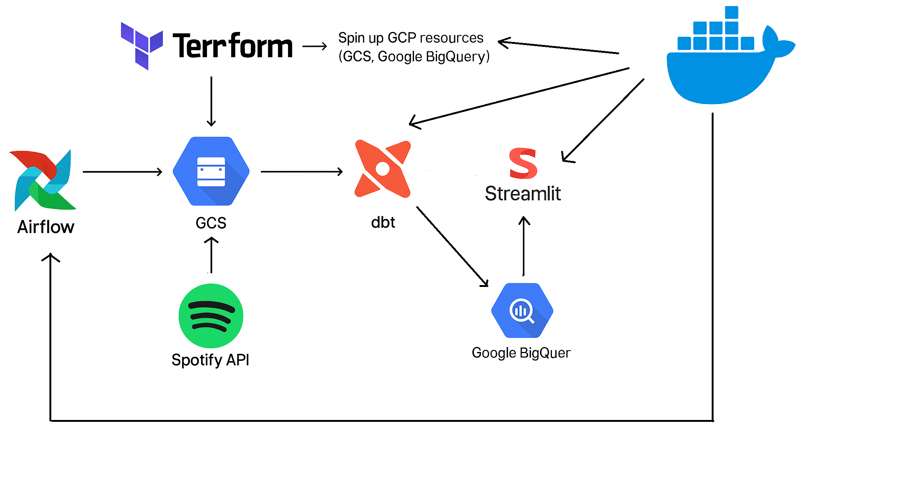

# Spotify Data Pipeline 🚀🎧

A modern data engineering pipeline that extracts data from the Spotify API and transforms it into analytics-ready datasets using Docker, Airflow, Terraform, Streamlit and dbt on Google Cloud Platform (GCP).

## 📄 Overview
This data engineering project focuses on building a batch processing pipeline that extracts music data from the Spotify API and transforms it into analytical models for exploration and analysis. The goal is to provide a structured and scalable workflow for handling artist, album, and track metadata using modern data tooling, enabling insights for music analysts or enthusiasts.


## 🛠 Tech Stack
- **Docker** – Containerized all components (Airflow, Terraform, Streamlit, DBT) for easy setup and portability.
- **Terraform** – Infrastructure as Code (IaC) to provision:
  - Google Cloud Storage bucket: `spotify_stg`
  - BigQuery datasets: `spotify_stg`, `spotify`
- **Airflow** – Orchestrates the entire pipeline from extraction to loading.
- **Spotify API** – Source of raw data (artists, albums, tracks).
- **Google Cloud Storage (GCS)** – Temporary staging layer for raw CSVs.
- **Google BigQuery** – Data warehouse for structured analytical queries.
- **dbt** – Transformations, modeling, and documentation of analytics tables.



## 📁 Project Structure
<pre lang="markdown"> ## 📁 Project Structure ``` 
```text
spotify/
├── dags/               # Airflow DAGs
├── common/             # Helper functions
├── terraform/          # Terraform configs
│   ├── main.tf
│   ├── variables.tf
│   └── ...
├── dbt/                # dbt models
│   ├── models/
│   └── ...
├── dashboard/          # Streamlit dashboard (optional)
├── credentials/        # GCP service account key
└── README.md
</pre>

## ✅ Prerequisites

Before running the project, make sure you have:

- **Spotify API Credentials**  
  - `client_id` and `client_secret` from the [Spotify Developer Dashboard](https://developer.spotify.com/documentation/web-api)  
  - Used for extracting data via Spotify Web API

- **Google Cloud Platform (GCP) Service Account**  
  - With permissions to create and manage:
    - **Google Cloud Storage (GCS)** buckets
    - **BigQuery** datasets and tables  
  - Export the credentials as `gcp.json` inside the `credentials/` directory

## ⚙️ Pipeline Overview

1. **Infrastructure Setup**  
   Use Terraform to spin up:
   - GCS bucket (`spotify_tuanlg`)
   - BigQuery datasets (`spotify_stg`, `spotify`)

2. **Data Extraction**  
   Airflow DAG extracts data from the Spotify API:
   - Artist, album, and track metadata
   - Auth handled via bearer token

3. **Staging**  
   - Data is written as CSV files to GCS
   - BigQuery external tables reference GCS data (`spotify_stg` schema)

4. **Transformation**  
   - dbt transforms raw data into dimensional models (`spotify` schema)
   - Factless fact tables for many-to-many relationships

## 📊 Dashboard (Optional)

- Streamlit app to visualize:
  - Artist popularity, album count, track statistics
  - Explicit content ratio and average duration

## Replicate the project
1. Spin up Terraform and provision infrastructure
   - Go to the terraform folder: cd spotify/terraform
   - Spin up terraform container: docker-compose up --build -d
   - Initialize terraform: docker-compose run --rm terraform terraform init
   - Plan infrastructure: docker-compose run --rm terraform terraform plan
   - Apply infrastructure: docker-compose run --rm terraform terraform apply
   - (Optional) Destroy infrastructure: docker-compose run --rm terraform terraform destroy


2. Run the Airflow DAG
   - From the root spotify folder: cd spotify
   - Spin up all services: docker-compose up --build -d
   - Go to http://localhost:8080
   - Trigger the DAG named spotify
   - ➡️ You will see 6 tables created in BigQuery:
      In `spotify` schema:
         `dim_artists`
         `dim_albums`
         `dim_tracks`
         `fctls_albums_artists`
         `fctls_tracks_artists`
         `fctls_albums_country_available`
      In `spotify_stg` schema:
         Raw data from Spotify API (`artists`, `albums`, `tracks`)

   

   


3. Run Streamlit Dashboard (optional)
   - From the root spotify folder: docker-compose run --rm --entrypoint "" python sh -c "streamlit run dashboard/spotify_dashboard.py"
   - ➡️ Open browser at http://localhost:8501 to view the dashboard.

   
---

This project is built for learning purposes and showcases a full modern data stack in action 💪

Flink Bro Rock <3 !!!